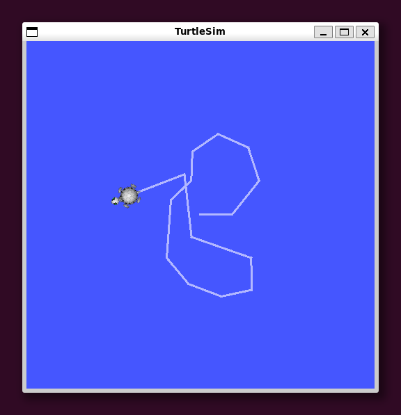
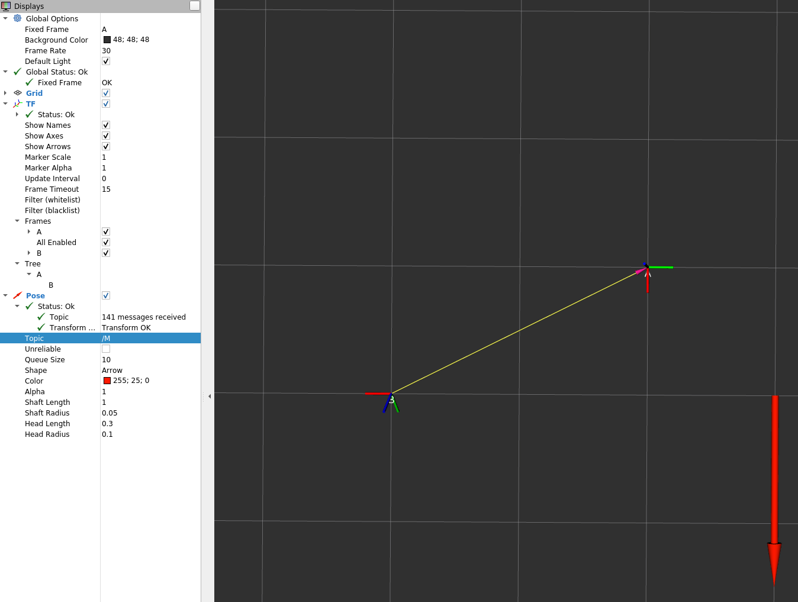

# ROS入门

在本次冬令营中，我们使用Ubuntu 20.04和ROS noetic作为开发环境。

## 安装Ubuntu

有以下几种方式使用Ubuntu：

- 安装Ubuntu作为设备的第二个系统

- 使用虚拟机安装Ubuntu

- 使用WSL安装Ubuntu

这里简要介绍WSL的安装方式。

第一步，启用WSL：

```powershell
dism.exe /online /enable-feature /featurename:Microsoft-Windows-Subsystem-Linux /all /norestart
```

第二步，启用虚拟机功能：

```powershell
dism.exe /online /enable-feature /featurename:VirtualMachinePlatform /all /norestart
```

现在需要重启计算机。

第三步，下载并安装内核包：

- https://wslstorestorage.blob.core.windows.net/wslblob/wsl_update_x64.msi

第四步，设置WSL2为默认版本：

```powershell
wsl --set-default-version 2
```

第五步，使用`wsl -l -o`检查一共有哪些WSL发行版可供使用，会显示以下内容：

```
NAME                                   FRIENDLY NAME
Ubuntu                                 Ubuntu
Debian                                 Debian GNU/Linux
kali-linux                             Kali Linux Rolling
Ubuntu-18.04                           Ubuntu 18.04 LTS
Ubuntu-20.04                           Ubuntu 20.04 LTS
Ubuntu-22.04                           Ubuntu 22.04 LTS
OracleLinux_7_9                        Oracle Linux 7.9
OracleLinux_8_7                        Oracle Linux 8.7
OracleLinux_9_1                        Oracle Linux 9.1
openSUSE-Leap-15.5                     openSUSE Leap 15.5
SUSE-Linux-Enterprise-Server-15-SP4    SUSE Linux Enterprise Server 15 SP4
SUSE-Linux-Enterprise-15-SP5           SUSE Linux Enterprise 15 SP5
openSUSE-Tumbleweed                    openSUSE Tumbleweed
```

我们需要20.04版本，之后使用`wsl --install Ubuntu-20.04`安装即可。

安装完成后，可以使用`wsl -l -v`检查版本信息，应该是类似于这样：

```
  NAME            STATE           VERSION
* Ubuntu-20.04    Stopped         2
```

这只是提取了官方文档中的关键部分，完整文档参见：

- [安装 WSL | Microsoft Learn](https://learn.microsoft.com/zh-cn/windows/wsl/install)

- [旧版 WSL 的手动安装步骤 | Microsoft Learn](https://learn.microsoft.com/zh-cn/windows/wsl/install-manual)

## 安装ROS noetic

第一步，设置sources.list：

```shell
sudo sh -c 'echo "deb http://packages.ros.org/ros/ubuntu $(lsb_release -sc) main" > /etc/apt/sources.list.d/ros-latest.list'
```

第二步，设置key

```shell
sudo apt install curl # if you haven't already installed curl
curl -s https://raw.githubusercontent.com/ros/rosdistro/master/ros.asc | sudo apt-key add -
```

第三步，更新package：

```shell
sudo apt update
```

第四步，安装ROS：

```shell
sudo apt install ros-noetic-desktop-full
```

第五步，更新bash：

```shell
echo "source /opt/ros/noetic/setup.bash" >> ~/.bashrc
source ~/.bashrc
```

第六步，安装依赖：

```shell
sudo apt install python3-rosdep python3-rosinstall python3-rosinstall-generator python3-wstool build-essential
```

第七步，初始化：

```shell
sudo rosdep init
rosdep update
```

这只是提取了官方文档中的关键部分，完整文档参见：

- [noetic/Installation/Ubuntu - ROS Wiki](https://wiki.ros.org/noetic/Installation/Ubuntu)

## ROS初探

首先，打开一个终端，启动roscore：

```shell
roscore
```

然后，再打开一个终端，运行turtle：

```shell
rosrun turtlesim turtlesim_node
```

最后，打开一个终端，为turtle启用键盘控制：

```shell
rosrun turtlesim turtle_teleop_key
```

然后，你应该可以使用方向键操作这个小海龟了：



## 项目创建与Vscode环境配置

首先，创建一个文件夹用于放置项目，并在其中创建src文件夹，例如：

```shell
mkdir ros
cd ros
mkdir src
```

然后，使用以下指令创建项目：

```shell
catkin_make
```

在工作目录（这里是ros目录）下，使用以下指令打开vscode：

```shell
~/ros$ code .
```

打开后，推荐安装以下拓展：


安装后如果没有生效就多关闭重开几次，之后应该会在`.vscode`文件夹下看到自动生成的`c_cpp_properties.json`和`settings.json`。

然后，右键src文件夹，选择`Create Catkin Package`：


设置包名，这里叫`lesson`；再输入依赖项，这里我们需要`roscpp std_msgs tf2_ros`。

在`lesson/src`目录下创建你的源文件，比如`lesson.cpp`：

现在来看很多人都没有做的进阶算法ROS操作题：

> 在ROS操作系统中实现以下程序：给定坐标系A和B，坐标系A到坐标系B之间的位置变换（x，y，z）为（1，-2，0），角度变换（roll，pitch，yaw）为（-90°，0，45°）；在坐标系A下有一个位姿点M，位置坐标（x，y，z）为（1，1，1），角度（roll，pitch，yaw）为（0，0，0）
> 
> a) 发布坐标系A和坐标系B之间的静态坐标系变换；（10分）
> b) 以geometry_msgs::PoseStamped为类型，发布位姿点M（在A坐标系下）的位姿话题信息；（10分）
> c) 以geometry_msgs::PoseStamped为类型，发布位姿点N（在B坐标系下）的位姿话题信息，使得点N与点M在空间中重合；（10分）
> d) 在ROS的可视化界面rviz中显示坐标系A和B之间的TF变换以及点M、点N的位姿信息，截图附在答案中；（10分）

第一题，发布坐标系A和坐标系B之间的静态坐标系变换：

```cpp
#include <ros/ros.h>
#include <geometry_msgs/TransformStamped.h>
#include <tf2_ros/static_transform_broadcaster.h>
#include <tf2_geometry_msgs/tf2_geometry_msgs.h>

int main(int argc, char** argv)
{
    ros::init(argc, argv, "lesson");

    // 发布坐标系A和坐标系B之间的静态坐标系变换
    geometry_msgs::TransformStamped transform_stamped;
    tf2_ros::StaticTransformBroadcaster static_broadcaster;
    tf2::Transform transform;
    transform_stamped.header.stamp = ros::Time::now();
    transform_stamped.header.frame_id = "A";
    transform_stamped.child_frame_id = "B";
    transform.setOrigin(tf2::Vector3(1, -2, 0));
    transform.setRotation(tf2::Quaternion(M_PI / 4, 0, M_PI / -2));
    transform_stamped.transform = tf2::toMsg(transform);
    static_broadcaster.sendTransform(transform_stamped);

    ros::Rate rate(10);
    while (ros::ok())
    {
        ros::spinOnce();
        rate.sleep();
    }
    return 0;
}
```

然后，在`CMakeLists.txt`的最后增加以下两行：

```cmake
add_executable(lesson src/lesson.cpp)
target_link_libraries(lesson ${catkin_LIBRARIES})
```

用`Ctrl+Shift+B`中的`catkin_make: build`来编译项目。

用`Ctrl+P`中的`>ROS: Start`启动roscore，，之后，使用`>Ros: Run`启动包。

**这个启动会export所有环境变量，但似乎有些问题，我没找到解决办法，但不影响使用就是了……**

现在，我们可以使用`rviz`查看静态坐标系变换了，在其中添加一个TF：


第二题，以geometry_msgs::PoseStamped为类型，发布位姿点M（在A坐标系下）的位姿话题信息：

```cpp
int main(int argc, char** argv)
{
    ros::init(argc, argv, "lesson");

    // 发布坐标系A和坐标系B之间的静态坐标系变换
    // 省略

    // 以geometry_msgs::PoseStamped为类型，发布位姿点M（在A坐标系下）的位姿话题信息
    geometry_msgs::PoseStamped M;
    M.header.frame_id = "A";
    M.pose.position.x = 1;
    M.pose.position.y = 1;
    M.pose.position.z = 1;
    M.pose.orientation.w = 1;

    ros::NodeHandle nh;
    ros::Publisher publisher_M = nh.advertise<geometry_msgs::PoseStamped>("M", 10);
    ros::Rate rate(10);
    while (ros::ok())
    {
        M.header.stamp = ros::Time::now();
        publisher_M.publish(M);
        ros::spinOnce();
        rate.sleep();
    }
    return 0;
}
```



第三题，以geometry_msgs::PoseStamped为类型，发布位姿点N（在B坐标系下）的位姿话题信息，使得点N与点M在空间中重合：

```cpp
int main(int argc, char** argv)
{
    ros::init(argc, argv, "lesson");

    // 发布坐标系A和坐标系B之间的静态坐标系变换
    // 以geometry_msgs::PoseStamped为类型，发布位姿点M（在A坐标系下）的位姿话题信息
    // 省略

    // 以geometry_msgs::PoseStamped为类型，发布位姿点N（在B坐标系下）的位姿话题信息，使得点N与点M在空间中重合
    geometry_msgs::PoseStamped N;
    geometry_msgs::TransformStamped transform_inversed;
    N.header.frame_id = "B";
    tf2::fromMsg(transform_stamped.transform, transform);
    transform_inversed.transform = tf2::toMsg(transform.inverse());
    tf2::doTransform(M.pose, N.pose, transform_inversed);

    ros::NodeHandle nh;
    ros::Publisher publisher_M = nh.advertise<geometry_msgs::PoseStamped>("M", 10);
    ros::Publisher publisher_N = nh.advertise<geometry_msgs::PoseStamped>("N", 10);
    ros::Rate rate(10);
    while (ros::ok())
    {
        M.header.stamp = ros::Time::now();
        publisher_M.publish(M);
        N.header.stamp = ros::Time::now();
        publisher_N.publish(N);
        ros::spinOnce();
        rate.sleep();
    }
    return 0;
}
```

这里主要的关键点在坐标系转换，我课上会讲。


第四题的截图已经在各个步骤中给出。文档里只给出了大致的代码解释，详细解释我会在课上讲述。
